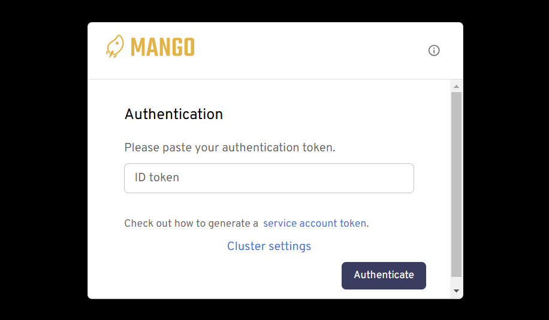
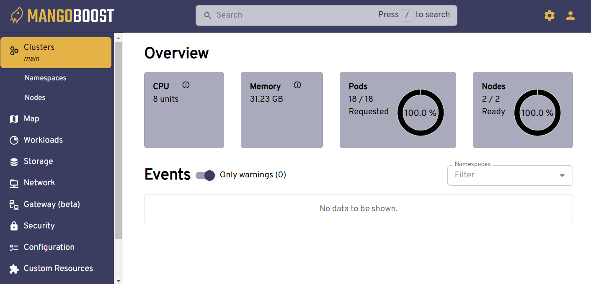

import Tabs from '@theme/Tabs';
import TabItem from '@theme/TabItem';


# Deploying LLM Inference on Multiple Nodes

In this tutorial, we will demonstrate using LLMBoost to easily start and manage LLM inference services using GPUs on multiple nodes.
To use this feature, you need to provide only a JSON description of the participating nodes.
Under the hood, LLMBoost orchestrates a multi-node containerized deployment using Kubernetes.

:::note
Kubernetes will be automatically configured by LLMBoost.
The user does not need to install Kubernetes manually on each worker node.
:::

### Step 0: Before you start

You first need to designate a "manager" node to run an LLMBoost container that controls the "worker" nodes.
The manager node can be one of the worker nodes for simple examples, but this is not recommended for production-grade Kubernetes setups.

Start the LLMBoost container on the manager node.
All of the commands in the tutorial should be run within the container.


<Tabs>
  <TabItem value="nvidia" label="On NVIDIA" default>

```bash
docker run -it --rm \
  --network host \
  --gpus all \
  --group-add video \
  --ipc host \
  --cap-add=SYS_PTRACE \
  --security-opt seccomp=unconfined \
  -v $MODEL_PATH:/workspace/models \
  -w /workspace \
  -e HUGGING_FACE_HUB_TOKEN=$HUGGING_FACE_HUB_TOKEN \
  $LLMBOOST_IMAGE \
  bash
```
</TabItem>

<TabItem value="amd" label="On AMD">
```bash
docker run -it --rm \
  --network host \
  --group-add video \
  --ipc host \
  --cap-add=SYS_PTRACE \
  --security-opt seccomp=unconfined \
  --device=/dev/dri:/dev/dri \
  --device=/dev/kfd:/dev/kfd \
  -v $MODEL_PATH:/workspace/models \
  -w /workspace \
  -e HUGGING_FACE_HUB_TOKEN=$HUGGING_FACE_HUB_TOKEN \
  $LLMBOOST_IMAGE \
  bash
```
</TabItem> 
</Tabs>

In addition, you need to set up SSH keys so you can log into the worker nodes from the manager node without typing a password; the SSH key itself also must not be password protected.

### Step 1: Describing the cluster (config.json)

Before using LLMBoost on a multi-node cluster, you need to provide information about the cluster.
Launch the LLMBoost container into an interactive command-line session on the manager node.
Edit the JSON file /workspace/cluster/config.json to specify model settings, node topology, and deployment roles.

The following are the required fields:

| Field                                  | Description                                                                 |
|----------------------------------------|-----------------------------------------------------------------------------|
| `vars.hf_token`                        | Your HuggingFace token for downloading models                               |
| `vars.model_name`                      | The model to load (e.g., `"meta-llama/Llama-3.2-1B-Instruct"`)              |
| `node_config.nodes.<name>.private_ip`  | The nodes' internal IP addresses for intra-node communication               |
| `node_config.nodes.<name>.public_ip`   | The nodes' public IP addresses or hostnames for external SSH access         |
| `node_config.common_ssh_option`        | Global SSH options (e.g., `User`, `IdentityFile`) used by all nodes         |
| `manager_node`                         | The hostname of the manager node                                            |
| `worker_nodes`                         | The hostnames of the worker nodes                                           |

The following example config.json file describes a 2-node cluster: node-0 and node-1.
Both nodes are workers with node-0 also designated as the manager.
The file also specifies the language model to use.

```json
{
    "vars": {
        "hf_token": "<PUT-YOUR-HF-TOKEN-HERE>",
        "model_name": "meta-llama/Llama-3.2-1B-Instruct"
    },
    "node_config":
    {
        "common_ssh_option":
        {
            "User": "suyoung.choi",
            "IdentityFile": "~/.ssh/id_rsa"
        },
        "nodes":
        {
            "node-0":
            {
                "private_ip": "10.4.16.1",
                "public_ip": "10.4.16.1"
            },
            "node-1": {
                "private_ip": "10.4.16.2",
                "public_ip": "10.4.16.2"
            }
        },
        "manager_node": "node-0",
        "worker_nodes":
        [
            "node-0",
            "node-1"
        ]
    }
}
```

### Step 2: Prepare and launch inference services

The installation artifacts need to be copied from the distributed Docker container to the host machine:
``` bash
MB_LLMBOOST_IMAGE=... # the name and tag of the LLMBoost Docker image (e.g. llmboost/mb-llmboost:prod-cuda)
CONTAINER_ID=$(docker create $MB_LLMBOOST_IMAGE)
docker cp "$CONTAINER_ID":/workspace/cluster .
docker rm "$CONTAINER_ID"
```

Once SSH access and `config.json` file are ready, navigate to the `cluster` directory copied from the previous step and run:

```bash
./llmboost_cluster
```

To enable verbose logging, the following can be done
```bash
ARGS=--verbose ./llmboost_cluster
```

> This will set up Kubernetes, installs dependencies, and initializes the manager and worker nodes.

This will output a login token that can be used to access the management UI explained below.

#### Step 2.1 Accessing the cluster management UI
The management UI is served at port 8081 of the control node. To access the UI, point the browser to the IP address of the server followed by the port number. For example, if the server is hosted at `10.128.0.1`, type in `10.128.1.1:30081` in the browser. `localhost:8081` may also be used if the browser is running on the same machine as the control node.

The management UI will show the following screen when accessing the UI for the first time:



After submitting the login token that was printed at the end of the installation, the following screen will show:



### Step 3: Monitoring the LLMBoost services

Before proceeding, we need to know if the inference services are ready to accept requests.  Give the inference service a few minutes to get set up after launching them. Afterwards, ping all of the endpoints from the manager node to check their status.

In our example, we have two workers with private IP addresses 10.4.16.1 and 10.4.16.2.  We can check their status from the manager node with the following commands:

```
curl 10.4.16.1:30080/status
curl 10.4.16.2:30080/status
```

Each curl command should return output (similar to what is shown below) indicating that the endpoints are running:

```
{"status":"running","server_name":"meta-llama/Llama-3.2-1B-Instruct"}
```

### Step 4: Accessing the LLMBoost services

You can test the inference services from any machine with network access to the worker nodes.
To try, start an LLMBoost container command shell on a remote machine and use the built-in LLMBoost client to test one of the inference services.
Note that if you are running on a node outside of your Kubernetes cluster, you will need to use the public IP address.
Use the following command:

```
# Establishing a connection with one of the endpoints
llmboost client --host 10.4.16.1 --port 30080
```

A better way to use the multi-node inference services is to distribute request traffic across them.
You can try this with a simple Python client script provided (client.py).

**Sample Python Client (`client.py`)**

```python
import argparse
import threading
from queue import Queue
from openai import OpenAI

# Define prompt list
prompts = [
    "how does multithreading work in Python?",
    "Write me a Fibonacci generator in Python",
    "Which pet should I get, dog or cat?",
    "How do I fine-tune an LLM model?"
]

# Thread worker for sending requests
def run_thread(host, queue: Queue):
    client = OpenAI(
        base_url=f"http://{host}/v1",
        api_key="-"
    )
    while not queue.empty():
        prompt = queue.get()
        chat_completion = client.chat.completions.create(
            model="meta-llama/Llama-3.2-1B-Instruct",
            messages=[
                {"role": "system", "content": "You are a helpful assistant."},
                {"role": "user", "content": prompt}
            ],
            stream=False,
            max_tokens=1000
        )
        print(
            f"-------------------------------------------------------------------\n"
            f"Question: {prompt}\nAnswer:{chat_completion.choices[0].message.content}"
        )

# Argument parsing
parser = argparse.ArgumentParser()
parser.add_argument("--hosts", nargs="+", help="list of servers <server_ip>:<port>")
args = parser.parse_args()

threads = []
queue = Queue()

# Populate the request queue
for prompt in prompts:
    queue.put(prompt)

# Launch threads for each host
for host in args.hosts:
    t = threading.Thread(target=run_thread, args=(host, queue))
    threads.append(t)
    t.start()

# Wait for all threads to complete
for thread in threads:
    thread.join()
``` 


**To run the client:**

```bash
python client.py --hosts 10.4.16.1:30080 10.4.16.2:30080
```


This command distributes the prompts across the specified worker nodes, demonstrating LLMBoost's ability to scale inference over a cluster.


#### Load Balancing

Instead of connecting to individual currents manually, a load balancer can be used to automatically distribute the 
loads. To do so, simply point the client to the port `8081` of the control node like so:

```bash
python client.py --hosts 10.4.16.1:8081
```

The load balancing is done with least-connection based routing where the nodes with the least amount of live connections
is prioritized to receive the incoming requests.
