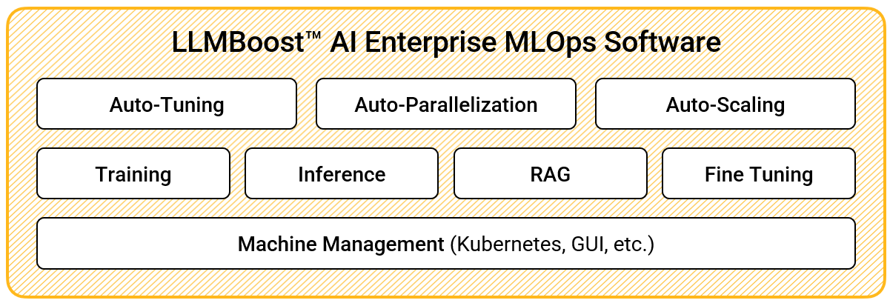

# Mango Documentation

A ready-to-deploy, full-stack MLOps platform for high-performance LLM training and inference—delivering unmatched scalability, cost-efficiency, and deployment flexibility across any environment.

 
## What is LLMBoost?

LLMBoost is MangoBoost’s enterprise-grade MLOps software platform designed to accelerate both training and inference of large language models (LLMs). It features patent-pending technologies for auto-tuning, model parallelism, batch scheduling, and memory optimization—enabling near-linear multi-node training scalability, as demonstrated in MLPerf Training v5.0 on AMD MI300X GPUs. LLMBoost also powers the highest MLPerf Inference v5.0 result in history for Llama2-70B in offline mode, showcasing its ability to deliver best-in-class inference performance. The platform is model-agnostic, hardware-flexible, and ready for deployment on public cloud or on-prem infrastructure.

## Key Components

### 🧠 [Inference](/llmboost/inference)
High-performance AI model inference with unprecedented speed and efficiency. Get started with deploying your models for production workloads.

### 📚 [Training](/llmboost/training)  
Comprehensive model training capabilities for developing custom AI solutions from scratch.

### 🔄 [Finetuning](/llmboost/finetuning)
Advanced model fine-tuning for adapting pre-trained models to specialized use cases and domains.

## Why Choose LLMBoost?

- **Performance**: Optimized for production workloads with minimal latency
- **Scalability**: Handle enterprise-scale AI deployments
- **Flexibility**: Support for various AI models and frameworks
- **Reliability**: Enterprise-grade infrastructure and support

## Get Started

Choose your path based on your needs:

- **New to AI deployment?** Start with [Inference](/llmboost/inference)
- **Building custom models?** Explore [Training](/llmboost/training)  
- **Adapting existing models?** Learn about [Finetuning](/llmboost/finetuning)